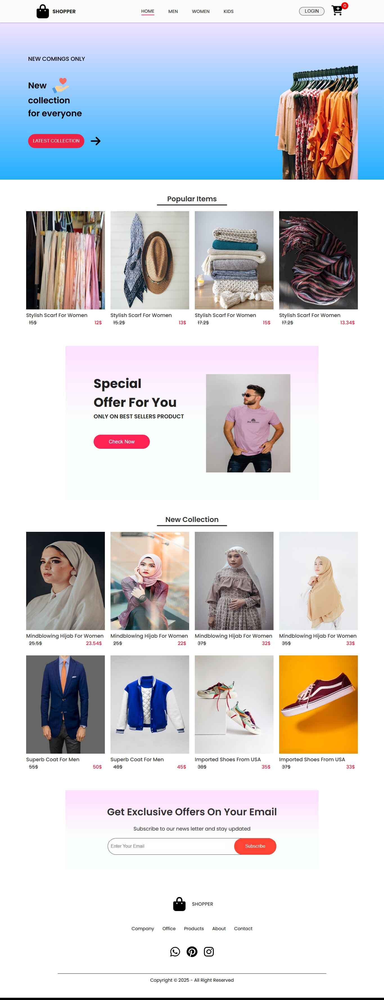
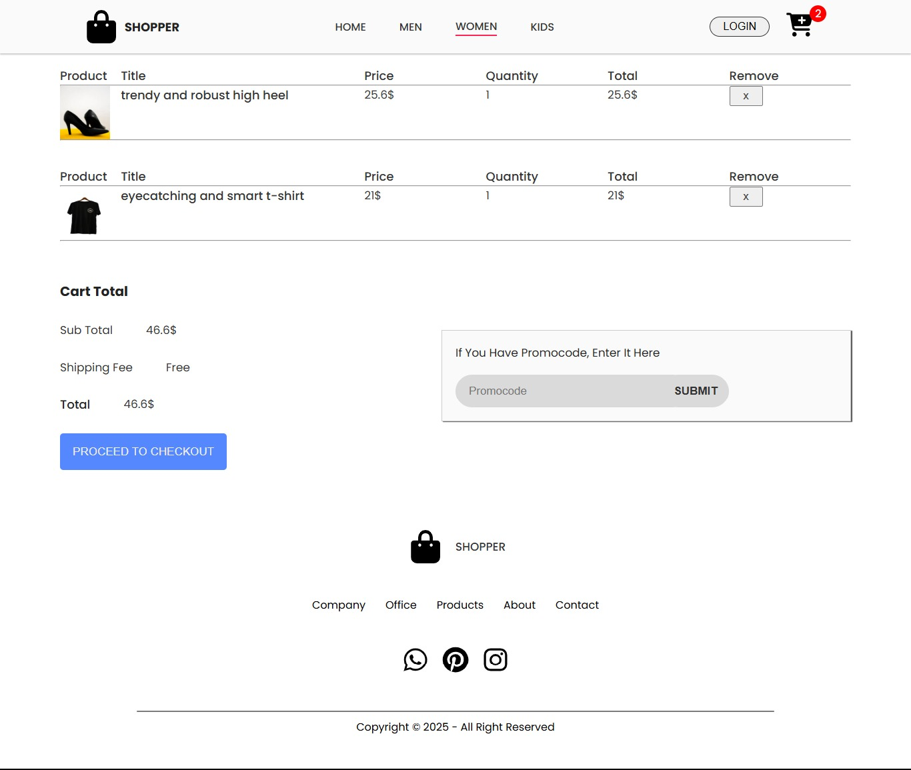
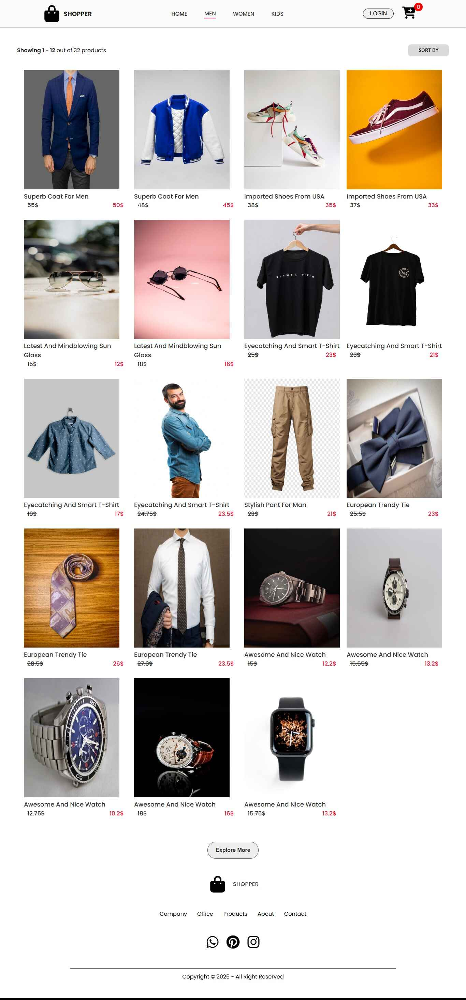
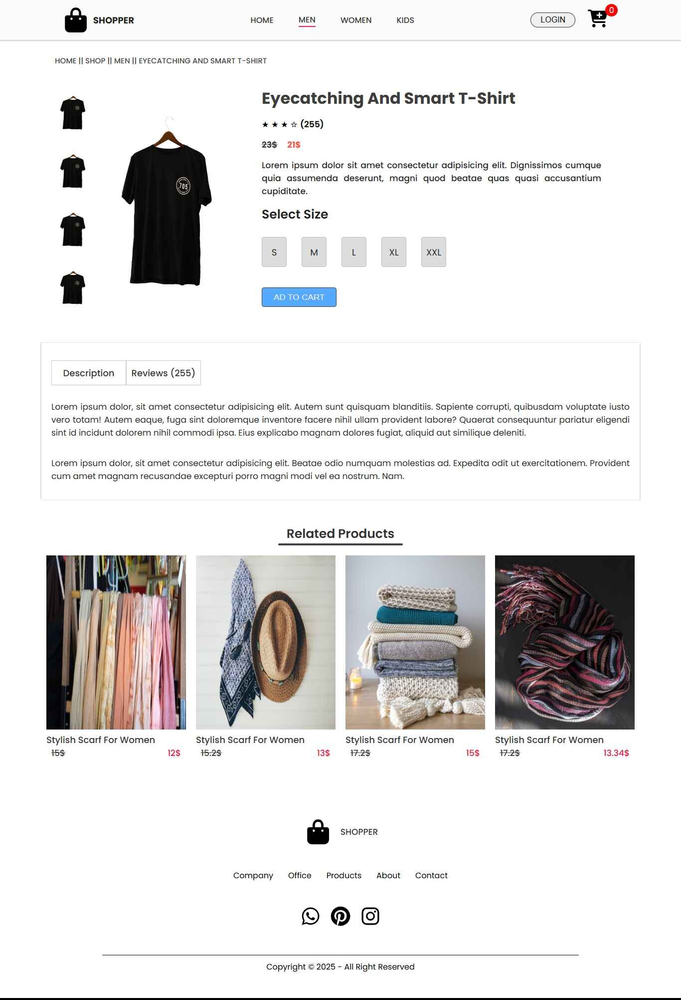
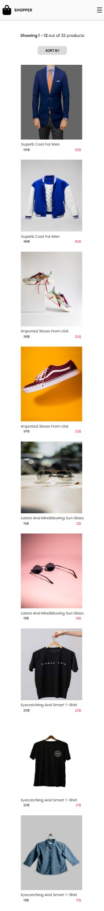

# 🛍️ E-Commerce Frontend (React + Vite)

This is a practice project developed while following a YouTube tutorial. It is a modern and responsive frontend UI for an e-commerce application, built using **React**, **Vite**, and **CSS**. The goal of this project was to gain hands-on experience with React fundamentals, component-based architecture, and basic state management using Context API.

---

## 🔗 Live Demo

👉 [Visit Live Site](https://frontend-ecommerce-project.netlify.app/)  
👉 [GitHub Repository](https://github.com/muhammad-shahadat/frontend-e-commerce)

---

## 🎯 Purpose of the Project

- To practice building a complete frontend UI using React
- To understand routing, component reuse, and responsive layout
- To learn how to manage global state with Context API
- To follow modern React best practices using Vite for performance

> 💡 This project was built strictly for learning and practice purposes. The structure and design are based on a YouTube tutorial. I do not claim original authorship of the concept or layout.

---

## ⚙️ Features

- ✅ Fully responsive design
- 🛒 Add to cart and view cart summary
- 💸 Promo code input (UI only)
- 🌐 Fast performance with Vite
- 📦 Clean folder structure and reusable components

---

## 🧰 Technologies Used

- **React**
- **Vite**
- **JavaScript (ES6)**
- **CSS (Custom)**
- **React Context API** for state management
- **Route** for page routing
- **Netlify** for deployment
- **GitHub** for version control

---

## 🖼️ Screenshots

### 🏠 Home Page


### 🛒 Cart Page


### 📦 Product Category Page


### 📦 Product Show Page


### 📱Mobile Views 


> 💡 Images are captured in both desktop and mobile views for a better presentation.

---


## Project structure
frontend-e-commerce/
├── screenshots/
│ ├── home.jpeg
│ ├── cart.jpg
│ ├── category.jpg
│ ├── product.jpeg
│ └── mobile_view.jpeg
├── public/
├── src/
│ ├── components/
│ ├── pages/
│ ├── App.jsx
│ └── main.jsx
├── .gitignore
├── package.json
├── vite.config.js
└── README.md

---

## 🚀 Getting Started Locally

```bash
git clone https://github.com/muhammad-shahadat/frontend-e-commerce.git
cd frontend-e-commerce
npm install
npm run dev

``` 
<!-- 🔚 Code block ends here -->
---


## 🙋‍♂️ Author
#### Muhammad Shahadat
📧 Email: shahadat6640@gmail.com<br>
🔗 LinkedIn: [linkedin.com/in/shahadatian](https://www.linkedin.com/in/shahadatian) 


