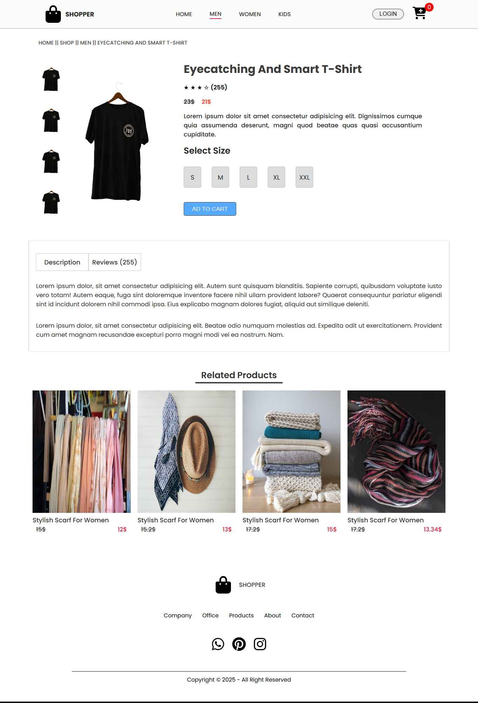
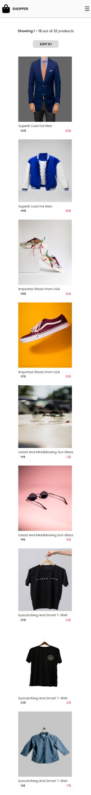

# 🛍️ E-Commerce Frontend (React + Vite)

This is the frontend of a modern and responsive e-commerce web application built using **React**, **Vite**, and **CSS**. It provides a clean and functional user interface for browsing products, adding items to the cart, and applying promo codes during checkout.

---

## 🔗 Live Demo

👉 [Visit Live Site](https://frontend-ecommerce-project.netlify.app/)  
👉 [GitHub Repository](https://github.com/muhammad-shahadat/frontend-e-commerce)

---

## ⚙️ Features

- ✅ Fully responsive design
- 🛒 Add to cart and view cart summary
- 💸 Promo code input (UI only)
- 🌐 Fast performance with Vite
- 📦 Clean folder structure and reusable components

---

## 🧰 Technologies Used

- **React**
- **Vite**
- **JavaScript (ES6)**
- **CSS (Custom)**
- **React Context API** for state management
- **Route** for page routing
- **Netlify** for deployment
- **GitHub** for version control

---

## 🖼️ Screenshots

### 🏠 Home Page


### 🛒 Cart Page


### 📦 Product Category Page


### 📦 Product Show Page


### 📱Mobile Views 


> 💡 Images are captured in both desktop and mobile views for a better presentation.

---


## Project structure
frontend-e-commerce/
├── public/
│   └── screenshots/
├── src/
│   ├── components/
│   ├── pages/
│   ├── App.jsx
│   └── main.jsx
├── .gitignore
├── package.json
├── vite.config.js
└── README.md


## 🚀 Getting Started Locally

```bash
git clone https://github.com/muhammad-shahadat/frontend-e-commerce.git
cd frontend-e-commerce
npm install
npm run dev

``` 
<!-- 🔚 Code block ends here -->


## 🙋‍♂️ Author
Muhammad Shahadat
📧 Email: shahadat6640@gmail.com
🔗 LinkedIn: linkedin.com/in/shahadatian 


